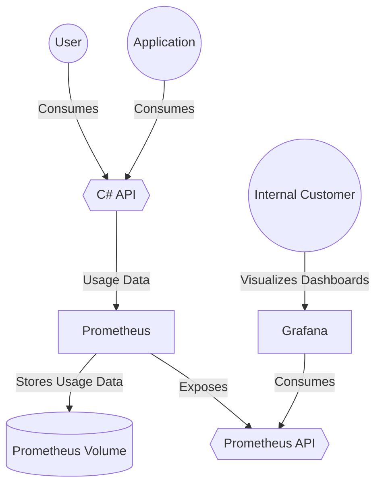

# Monitoring/Observability PoC

A repository containing monitoring and observability PoC using Grafana + Prometheus.

This will be the simple architecture for this PoC:



## Running Instructions

To run this project, all you need to do is to run docker compose command

```
docker compose up -d
```

Since this is only a PoC, the API is running on HTTP and you would be able to access its swagger via http://localhost:8080/swagger/index.html

The metrics for the API can be found at http://localhost:1234/metrics
