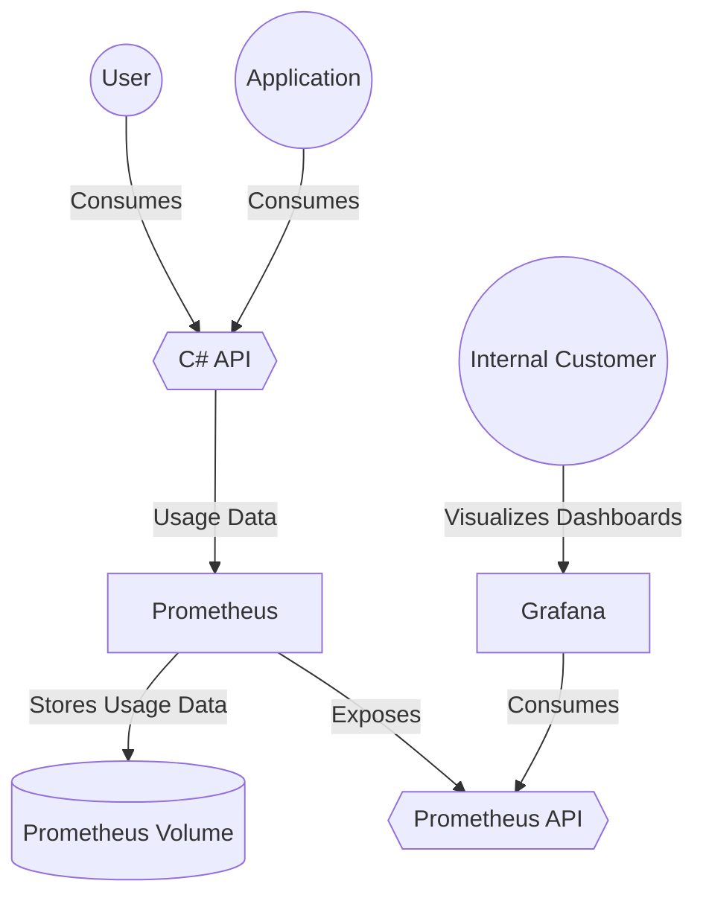

# Monitoring/Observability PoC

A repository containing monitoring and observability PoC using Grafana + Prometheus.

This will be the simple architecture for this PoC:

```mermaid
flowchart TD
    user((User)) -- Consumes --> api{{C# API}}
    application((Application)) -- Consumes --> api
    api -- Usage Data --> prometheus[Prometheus]
    prometheus -- Stores Usage Data --> prometheus_volume[(Prometheus Volume)]
    prometheus -- Exposes --> prometheus_api{{Prometheus API}}
    grafana[Grafana] -- Consumes --> prometheus_api
    internal_customer((Internal Customer)) -- Visualizes Dashboards --> grafana
```
